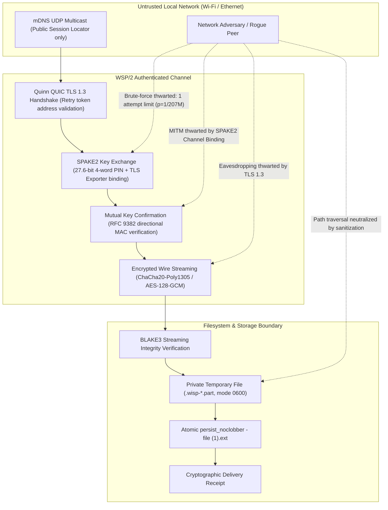

# Wisp 0.2 security model

This document describes the implemented WSP/2 CLI protocol. It is not an independent audit or a claim of formal verification.

## Scope and assumptions

Two users deliberately transfer one regular file over a reachable local IPv4 network. They share a fresh pairing code through a channel they trust. Both endpoints and the destination directory must be under their control. Anyone holding the complete code can act as a peer. File contents are not scanned for malware and are never automatically executed.

A network adversary can observe, spoof, reorder, redirect or drop discovery and transfer traffic. Network availability and traffic-analysis resistance are not guaranteed. Persistent pairing, internet relays, IPv6 and NAT traversal are not supported in this release.

## Threat matrix & security boundaries

| Threat Vector / Attacker Profile | Threat Description | WSP/2 Defense Mechanism | Residual Risk |
| :--- | :--- | :--- | :--- |
| **Passive Wi-Fi Sniffer** | Captures all multicast and unicast packets on the local subnet. | TLS 1.3 AEAD encryption. Password is never transmitted in the clear or hashed; SPAKE2 derives symmetric keys via Diffie-Hellman operations over Curve25519. | Traffic volume, timing, and peer IP addresses remain observable. |
| **Active MITM / ARP Spoofing** | Intercepts QUIC packets and attempts to act as man-in-the-middle. | SPAKE2 mutual key confirmation MAC directly incorporates a 32-byte TLS channel exporter. Without the 4-word secret, an attacker cannot complete the handshake on either leg. | Adversary can drop packets to deny service. |
| **Online PIN Brute-Force** | Tries password candidates across multiple connection attempts. | Strict single-attempt policy: exactly one SPAKE2 authentication attempt permitted per session code. Any MAC mismatch immediately and permanently terminates the session. | Probability of guessing on the single attempt is $1 / 120^4 \approx 1 / 207{,}360{,}000$. |
| **Pre-Auth Network Flooder** | Sends unauthenticated UDP probes or port scans to exhaust sender state. | QUIC Retry tokens validate source IPv4 before allocating memory. Senders tolerate up to 3 pre-auth transport attempts while retaining mDNS broadcast. | Heavy network-level UDP flooding can cause socket buffer exhaustion. |
| **Malicious Path Traversal** | Sender sends malicious filenames like `../../etc/shadow` or Windows device names. | Filename sanitizer strips all directory separators, Windows drive letters, UNC paths, reserved device names (`CON`, `PRN`, `AUX`, `NUL`, `CLOCK$`), and Unicode RTL override characters. | None; only flat, sanitized basename is ever used. |
| **Destination File Clobbering** | Malicious or accidental overwrite of existing critical files. | Receiver writes to private random `.wisp-*.part` file, then atomically publishes via `persist_noclobber`. Collisions automatically append `(1)`, `(2)` suffixes. | None; existing files and symlinks are never overwritten. |
| **Payload Tampering / Bit Flips** | Modifies payload in transit or cuts stream prematurely. | BLAKE3 cryptographic streaming checksum verified on the fly against sender metadata. Receiver aborts and deletes temp file if end-of-stream or digest mismatches. | None; unverified bytes are never published. |

## Discovery is public; the password is not

A code has an independent random eight-digit locator and four independently sampled words from a 120-word list, with replacement. The four words provide log2(120^4), approximately 27.6 bits, of secret entropy. The locator is public and contributes no authentication secrecy.

mDNS advertises only the locator, ephemeral TLS certificate fingerprint and protocol version. It advertises **no password hash or password-derived commitment**, filename, file size or content checksum. An attacker cannot enumerate a discovery hash to narrow the four secret words. Public locators can collide; a collision can cause discovery/authentication failure, not acceptance without the secret.

The sender uses QUIC Retry to validate the receiver's source address before committing the session, which limits spoofed-source amplification and state exhaustion. To prevent transient network resets or unauthenticated port probes from preempting legitimate transfers, the sender permits up to 3 transport-level connection attempts prior to authentication while retaining its mDNS advertisement. However, once bidirectional stream setup and SPAKE2 key exchange begin, exactly one authentication attempt is permitted per pairing code; any failed authentication or MAC mismatch immediately and permanently terminates the session to prevent online password guessing. Waiting codes expire after 300 seconds by default, configurable from 1 to 3600 seconds. Each new invocation generates a new code. The CLI never accepts a user-chosen send password.

For a uniformly generated password, one online guess has probability 1/120^4 (about one in 207 million). This is conditional on correct implementation of the PAKE and the stated one-attempt policy; it is not a substitute for an audit. A malicious party can intentionally consume a session or spoof discovery to deny service. Expanding to 44 bits (e.g., BIP-39 2,048-word vocabulary) is reserved for a future WSP/3 protocol upgrade to maintain compatibility across Wisp 0.2.x releases.

## Transport and peer authentication

Each sender creates a fresh self-signed TLS certificate in memory. No long-lived device keys are created. QUIC uses TLS 1.3 and ALPN `wsp/2`. The receiver pins the discovered certificate when using mDNS. A fingerprint learned from unauthenticated discovery is not by itself a trusted identity.

With `--address`, the receiver accepts a self-signed certificate but still checks TLS handshake signatures. In both modes, peers must complete SPAKE2 and mutual key confirmation before file metadata is sent. The confirmation MAC includes a 32-byte TLS exporter value and distinct sender/receiver labels, binding authentication to this TLS connection. Direct-address mode does not bypass authentication. TLS connection, authentication-stream creation, PAKE and individual transfer operations have deadlines. No early-data transfer or insecure flag exists. QUIC TLS 1.3 already provides authenticated payload encryption (ChaCha20-Poly1305 / AES-128-GCM); application-layer double encryption is omitted as cryptographically redundant.

The SPAKE2 implementation comes from the `spake2` crate. Wisp's BLAKE3-based key confirmation and TLS channel-binding composition are application protocol choices. Mutual key confirmation complies with RFC 9382 role binding, using explicit directional labels. They have regression tests, not a formal proof of this complete implementation. [RFC 9382](https://www.rfc-editor.org/rfc/rfc9382.html) describes the underlying SPAKE2 protocol; it is not an endorsement or audit of Wisp.

## File integrity and filesystem behavior

The sender hashes an open regular-file handle before advertising. It rewinds and transmits that same handle, bounded by the prepared size, and hashes it again while sending. Replacing the path cannot switch the opened file; modifying the file can fail the transfer. This is not a filesystem snapshot facility: stop editing a source while sending it.

Only an authenticated peer can send metadata. JSON frames are limited to 4096 bytes and reject unknown fields. Incoming file size is bounded by a receiver-configurable cap, at most 1 TiB. An authenticated malicious sender can consume disk space up to that cap; select a smaller `--max-size` when appropriate. Exact size, end-of-stream and BLAKE3 checksum must agree before publication.

Files are written to private randomly named `.wisp-*.part` files inside the chosen destination filesystem. On Unix, temporary files are created with mode 0600. Received permissions are not copied from the sender; files are not marked executable. Filename sanitization strips both Unix and Windows path components, control and bidirectional override/isolate characters, Windows reserved device names (including `CLOCK$`) and trailing dots/spaces. UTF-8 filenames are bounded to leave room for collision suffixes.

Temporary files are flushed and synced before publication. `tempfile::persist_noclobber` publishes without replacing an existing file or symlink; collisions are retried with a suffix. Unix destination directories are synced after publication. When filesystem mount restrictions (such as NFS, CIFS, FUSE, or non-POSIX filesystems) prohibit syncing directories, Wisp logs a non-fatal warning but preserves the safely persisted file and issues the delivery receipt. Filesystem semantics and hardware still determine crash durability; Windows directory durability is not separately forced. Wisp does not defend against a malicious local process that controls the destination directory or compromises the user's account.

Ordinary failures and handled SIGINT/SIGTERM drop the private temporary file. SIGKILL, power failure or a process crash can leave a partial file. Wisp does not sweep directories on startup: users may manually remove clearly abandoned `.wisp-*.part` files after checking that no transfer is active.

## Delivery confirmation

The receiver publishes only verified bytes, then sends a bounded receipt containing the saved name, size and checksum. The sender validates it before reporting delivery. Sending all bytes, closing a stream or timing out does not establish delivery.

A peer holding the secret can lie about saving a file; the receipt authenticates that peer's assertion, not its storage hardware. If the receipt is lost, the sender reports delivery as unconfirmed. The receiver keeps its verified file and warns that sender confirmation is uncertain. Check the destination before retrying. Cancellation after a save can likewise leave a complete file, which Wisp does not delete.

## Metadata, retention and limits

Observers still see endpoint addresses, timing, approximate traffic volume and the presence of Wisp. There is no anonymity or traffic padding. Filename, declared size, hash and file contents travel within the authenticated encrypted stream. Codes appear in terminal output and process arguments; shell history, process inspection and redirected JSON logs can expose them. Debug formatting of `PairingCode` redacts the secret. Human-readable diagnostics, completion receipts and status messages escape terminal controls and Unicode bidirectional formatting/override characters (LRM, RLM, ALM, LRE, RLE, PDF, LRO, RLO, LRI, RLI, FSI, PDI) received from peers; JSON output relies on standard JSON escaping. Configuration files are capped at 64 KiB to prevent memory exhaustion from oversized files.

The application contains no analytics, account system, external font requests or cloud service calls. Optional installers fetch releases from GitHub; development tooling fetches packages and advisory data. Local configuration stores preferences only.

Report security concerns through the repository's private security-reporting facility if enabled. Do not publish a live code or confidential file in an issue. Independent protocol review and physical cross-platform network testing remain part of release assurance.
